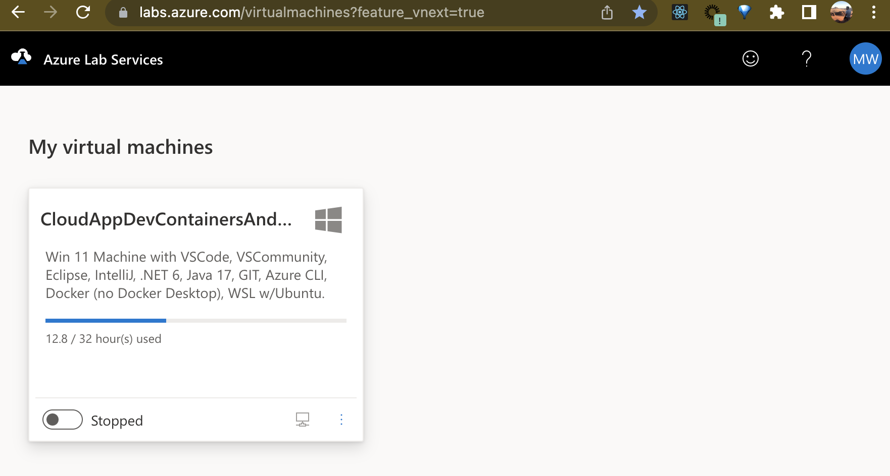
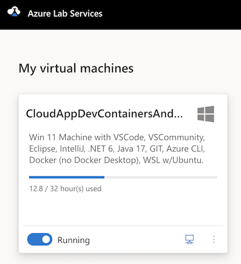
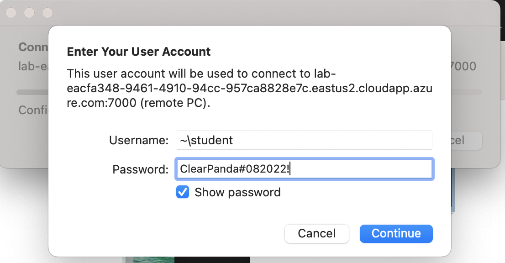

# OOP Foundations Summer Workshop

| Session |	Lesson | Lab | 
| --- | --- | --- |
| Morning |	[Intro to OOP](/intro-oop-lesson/) ----- [Objects and Classes](/objects-and-classes-lesson/) | [Creating Classes Lab](/creating-classes-lab/) |
| Afternoon |	[Debugging](/debugging-lesson/) ----- [Exception Handling](/exception-handling-lesson/) | [Exception Handling Lab](/exception-handling-lab/) |

# Welcome to the Java OOP Essentials Workshop

In this course you will learn how to get started with the basics of Object-Oriented Programming (OOP) using Java

## What you will learn

During this course you will learn the following:

- How to work with Java 
- Classes
- Inheritance
- Simple Design Patterns

## What you will need

At a minimium, you need the following items to complete this course 

- A development machine with the following:
    - Java SDK (17/20)
    - VS Code or IntilliJ or Eclipse or Netbeans
    - A Terminal
- The source code associated with this course

>**Note:** The above (and more) is likely provided for you as part of this course

## Pre-Provisioned Environment

If the environment is provisioned for you, then you will need to go through the following steps:

<!-- 1) Send your work email and your personal email (likely your-name@somecompany.com and your-email@someemaillikegmailyahoooroutlook.com)
2) Once we have both of your emails, you will receive an invitation to get a cloud lab machine from us, sent to your work email -->

1. As we get started, please make sure you're in the **M+T Guest WIFI**.

2. Please use your credentials below to login to [Azure Labs](https://labs.azure.com) where you will get a VM assigned to you. You'll need your `VM/Azure Login` and `Password`.

| Count | Locations | Full Name         | VM/Azure Login                                    | Password        | Resource Group  |
| ----- | --------- | ----------------- | ------------------------------------------------- | --------------- | --------------- |
| 1     | Buffalo   | Aditi Vishwanath  | ga-student-202306-0001@majorguidancesolutions.com | Cava262131#882! | ga-student-0001 |
| 2     | Buffalo   | Alex Hetrick      | ga-student-202306-0002@majorguidancesolutions.com | Canu304175#205! | ga-student-0002 |
| 3     | Buffalo   | Amber Lai         | ga-student-202306-0003@majorguidancesolutions.com | Sapa708470#027! | ga-student-0003 |
| 4     | Buffalo   | Dominick Delmonte | ga-student-202306-0004@majorguidancesolutions.com | Hoka097615#515! | ga-student-0004 |
| 5     | Buffalo   | Eric Scott        | ga-student-202306-0005@majorguidancesolutions.com | Pula969155#470! | ga-student-0005 |
| 6     | Buffalo   | Ethan Abbate      | ga-student-202306-0006@majorguidancesolutions.com | Dutu129232#853! | ga-student-0006 |
| 7     | Buffalo   | Ethan Chou        | ga-student-202306-0007@majorguidancesolutions.com | Mumo896612#018! | ga-student-0007 |
| 8     | Buffalo   | Ethan Phan        | ga-student-202306-0008@majorguidancesolutions.com | Huru988694#671! | ga-student-0008 |
| 9     | Buffalo   | Faris Attallah    | ga-student-202306-0009@majorguidancesolutions.com | Bada531537#942! | ga-student-0009 |
| 10    | Buffalo   | Herman Singh      | ga-student-202306-0010@majorguidancesolutions.com | Waru518916#984! | ga-student-0010 |
| 11    | Buffalo   | Jacky Lin         | ga-student-202306-0011@majorguidancesolutions.com | Xago862595#713! | ga-student-0011 |
| 12    | Buffalo   | Joey Zheng        | ga-student-202306-0012@majorguidancesolutions.com | Nutu637948#461! | ga-student-0012 |
| 13    | Buffalo   | John Hart         | ga-student-202306-0013@majorguidancesolutions.com | Baxo512602#960! | ga-student-0013 |
| 14    | Buffalo   | Jordan Miller     | ga-student-202306-0014@majorguidancesolutions.com | Toja335148#139! | ga-student-0014 |
| 15    | Buffalo   | Kara Kolodinsky   | ga-student-202306-0015@majorguidancesolutions.com | Cata257036#987! | ga-student-0015 |
| 16    |           |                   | ga-student-202306-0016@majorguidancesolutions.com | Hoto455766#704! | ga-student-0016 |
| 17    | Buffalo   | Liam Chen         | ga-student-202306-0017@majorguidancesolutions.com | Bulo162219#516! | ga-student-0017 |
| 18    | Buffalo   | McKenna Shay      | ga-student-202306-0018@majorguidancesolutions.com | Wabo015944#952! | ga-student-0018 |
| 19    | Buffalo   | Rachel DeFeo      | ga-student-202306-0019@majorguidancesolutions.com | Yava535822#111! | ga-student-0019 |
| 20    | Buffalo   | Rakshan Joshi     | ga-student-202306-0020@majorguidancesolutions.com | Zuda658571#389! | ga-student-0020 |
| 21    | Buffalo   | Rebecca Ramhap    | ga-student-202306-0021@majorguidancesolutions.com | Qocu120928#003! | ga-student-0021 |
| 22    | Buffalo   | Reese Lodwick     | ga-student-202306-0022@majorguidancesolutions.com | Mapa746035#104! | ga-student-0022 |
| 23    | Buffalo   | Renee Sen         | ga-student-202306-0023@majorguidancesolutions.com | Jobu710287#694! | ga-student-0023 |
| 24    | Buffalo   | Savina Chan       | ga-student-202306-0024@majorguidancesolutions.com | Sujo561224#736! | ga-student-0024 |

3. Once you login, you can start and stop the machine from **labs.azure.com**. You will also be able to get the VM RDP (Remote Desktop) information there (you should already have this software on your PC).

    

4. Start the VM by clicking the "Stopped" toggle button. It may take a few seconds to warm up. Once the VM is "Running" you can click on the PC icon on the bottom right to launch the Remote Desktop.

    

5. If asked for a password, use `ClearPanda#082022!`. Your username _may_ be different from the screenshot.

    

<!-- 1. Once you are on the Dev Machine, open a browser to your personal email. -->

### To access Azure Portal in the VM

1. Open Google Chrome
2. Go to [the Azure Portal](https://portal.azure.com). Please use your `VM/Azure Login` and `Password` from the table above to login.
<!-- 1. From your personal email, you'll have an invitation to join the Azure Subscription via a link to [the Azure Portal](https://portal.azure.com) 
    > **IMPORTANT** Do not use your work machine or try to log into the Azure portal from your work machine with your personal email.  This needs to be done from the Lab VM only.  If you use your work email you will likely be in your work's Azure subscription or blocked from ours so you will not be able to complete the work for this course. -->
3. After logging into Azure, validate you can see one resource group (something like `student0025` where the number is just the student number we have assigned you in the table above.
    > **Note**: You can view resource groups by typing `Resource Group` in the top middle search bar on the browser and hitting enter.

### To test Docker commands in the VM

1) Start any terminal or powershell
2) Type `wsl` and enter WSL Mode
3) Enter the same credentials to log in
student
ClearPanda#082022!
4) in the ubuntu instance, type
`sudo service docker start`
5) run docker commands at will.

You are now ready to begin the class.  Good Luck! Have Fun! Enjoy the training!
