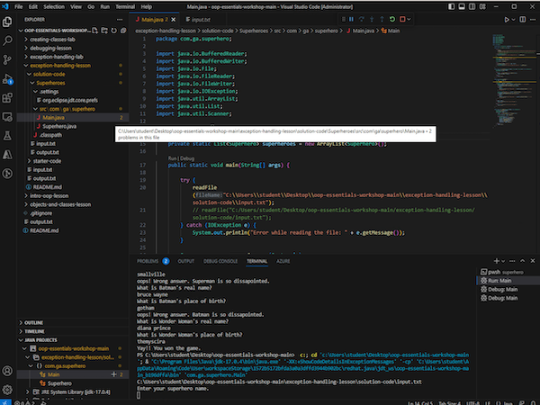

#  Exception Handling Lab

## Lab: File Reading and Writing (45 min)

Create an app that quizzes users on superhero trivia. Open the `Superheroes` [starter code](../exception-handling-lesson/starter-code/Superheroes) and start working from there.

Your app reads the superhero info from an `input.txt` file and stores it in an `ArrayList`. Based on the answers, keep count of every right and wrong one. If the number of right answers is greater than wrong ones, declare the user a winner and write the user's name and the result of the quiz in an `output.txt` file.

You can refer to the solution code [here](../exception-handling-lesson/solution-code/Superheroes).
***

## Conclusion (5 min)

Exceptions are an important part of keeping our apps running when problems occur. Sometimes, these problems — such as certain file I/O or networking situations — are out of our hands, and we need to be prepared to handle them.

***

## VM File Path (5 min)

If you get a scanner error it could be due to how the VM handles file paths. You may need to right click and copy the file path for the `input.txt` file. A screenshot is below (based on the repo being on the Desktop of the VM).

***

## Additional Resources
- [`try` Blocks](https://docs.oracle.com/javase/tutorial/essential/exceptions/try.html)
- [`catch` Blocks](https://docs.oracle.com/javase/tutorial/essential/exceptions/catch.html)
