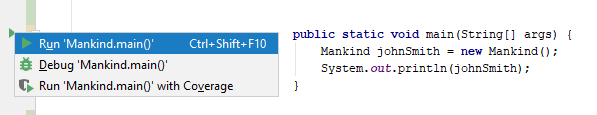
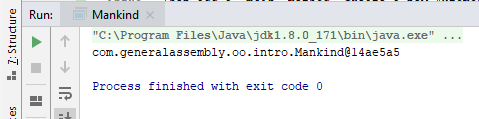
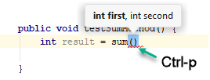

| Title | Type | Duration | Creator |
| --- | -- | -- | --- |
| Objects and Classes | Lesson | 1:15 | Victor Grazi, NYC |


#  Objects and Classes

### Learning Objectives

At the end of this lesson, students will be able to:
- Instantiate and use an object from a class.
- Create an instance with the `new` keyword.
- Add fields and methods to a class.
- Write constructors (including ones that accept arguments).

### Lesson Guide

| Timing  | Type  | Topic  |
|:-:|---|---|
| 5 min  | Opening  | Learning Objectives | 
| 15 min | Guided Practice | Class Creation |
| 20 min | Guided Practice | Class Features | 
| 10 min | Independent Practice | Calculator Class |
| 20 min | Guided and Independent Practice | Constructors |
| 5 min  | Conclusion  | Review/Recap |

## Opening (5 min)

In OOP, a class is a kind of template for creating **objects**. An object is an **instance** of a class — it contains all of the data fields and functionality defined in its class.

However, each object can contain its own set of values for those fields. For example, a class might define a `name` field of type `String`, but individual instances of that class might have unique values assigned to the `name` field, such as "Jeremy," "Maria," "Carlotta," and so on. 

> **Tip**: Instantiation is a large word, but it comes from the word "instance," which is a little easier to understand. Instantiation is the practice of creating instances (aka, objects) from classes.

**Think of it like so:**

We know humankind is a classification of a creature that thinks, senses, has a body, and more. But we don't think of a specific person as humankind: `HumanKind` is the class, while "Vanna White" is an **instance** of `HumanKind`. Vanna has a name, birth date, brown eyes, two ears, legs, and so on. 

----

## Guided Practice: Step-by-Step Class Creation (15 min)

Let's make this more concrete by creating a class called `HumanKind`. For now, we'll just create a shell of the class, and we can add to it as we go.

### Step 1

First, create the file for the `public` `HumanKind` class. 

> **Knowledge Check**: What would the file name be? It should be `HumanKind.java`.

We must create it in a directory that mimics the package name, i.e., `src/com/generalassembly/oop/intro/HumanKind.java`.

```java
package com.generalassembly.oop.intro;

public class HumanKind {
    
}
```

### Step 2

Next, let's add a `main` method so we can execute our code. (Remember: A `main` method defines the entry point of a program.)

> **Tip**: If you hate typing, IntelliJ has a convenient shortcut for defining a `main` method: Just type `psvm` (which stands for `public static void main`) and hit the `tab` key. That's an example of an IntelliJ **live template**. Getting familiar with these will make you a speedy programmer.

```java
package com.generalassembly.oop.intro;

public class HumanKind {
    public static void main(String... args) {
        
    }
}
```

We've now defined our `HumanKind` class. But classes are not much good until they're **instantiated**.

### Step 3

To create an instance of the `HumanKind` class, you need to call the `HumanKind` **constructor**. This is done using the `new` keyword.

Let's add that instance creation to our `main` method, then print out our instance as follows:

```java
package com.generalassembly.oop.intro;

public class HumanKind {
    public static void main(String... args) {
        HumanKind vannaWhite = new HumanKind();    
        System.out.println(vannaWhite);
    }
}
```

Voila! We have a new instance of `HumanKind`.

**Let's analyze that:**

- `HumanKind vannaWhite` declares a variable of type `HumanKind` and names that variable `vannaWhite`. The `=` sign assigns everything on its right to the variable on its left.

   > **Tip**: Remember the Java naming convention: camel case for variable names, and classes starting with a capital letter.

- `new HumanKind()` calls the constructor, which is a method with the same name as the `HumanKind` class. Notice that, even though we didn't write a constructor method called `HumanKind()`, Java provides one by default. A constructor is called to **construct** (or create) a new instance of a class using that class as a template. This process is known as instantiation: We're **instantiating** a new object (i.e., creating a new instance of the class).

So in plain English, this statement is saying, "Declare a new variable named `vannaWhite` of type `HumanKind` and assign it a new instance of the class `HumanKind`."

```java
HumanKind vannaWhite = new HumanKind();
```

### Step 4 

Finally, to run our program on IntelliJ, notice the little green arrow on the margin, to the left of our `main` method:



Give that arrow a left click, then click on "Run HumanKind.main()." That will compile and execute our code and produce output similar to this:



----

## Guided Practice: Class Features (20 min)

Now that we've looked at an example of a class, let's break down its different pieces and take a look at what exactly they're doing.

So far, we've seen how to define the shell of a class. But we'll start to realize the value of a class when we add **members** to it. Members of a class include:
- Fields
- Methods
- Inner classes

Let's look at fields and methods.

### Fields

**Fields** are variables associated with each instance of a class.

> **Knowledge Check**: What are some fields our `HumanKind` class might have? Take a few minutes to create three fields for our `HumanKind` class.

<details>
<summary>Possible Solution</summary>

```java
public class HumanKind {
    private int id;
    private String name;
    private String address;
}
```

</details>


#### Instance vs. Class Variables

Most fields are called **instance variables** because they're contained within an instance of a class. Two different instances of the same class might have completely different values for their instance variables.

You'll frequently hear the fields of an object referred to as its **state**. State essentially describes the object and defines what distinguishes it from any other object of the same class.

For example, if our `HumanKind` class has an `age` field, then `vannaWhite.age` might be 62, while `patSajak.age` might be 72.

> How neat is that syntax? `vannaWhite.age` references the `age` field of the object referred to by the `vannaWhite` variable.

Not all fields are instance variables. If a field is declared `static`, then it's called a **class variable**. A class variable shares its value among all instances of that class. Additionally, you don't need to have access to an instance to access a class variable. If the value of a class variable changes for one instance, it changes for all instances. We'll see examples of this shortly, along with why it's useful.

There's one rule you'll need to remember starting today: Make fields in a class `private`, then provide **accessor** (also called **getter**) and **mutator** (also called **setter**) methods for those fields. This is known as **encapsulation**: You never expose the structure of a class to anything outside of it.

### Methods

Methods provide the functionality for objects instantiated from a class. We call a method when we want our object to do or change something. 

> **Knowledge Check**: What methods might we add to the `HumanKind` class? 

<details>
<summary>Possible Solution</summary>

We might have a `setAddress()` method that alters the `address` field's value.

```java
public class HumanKind {
    private String address;
    
    public void setAddress(String address) {
        this.address = address;
    }    
}
```

</details>

Let's study that structure:

1. As with any class member, we start the method declaration with its **visibility**. In this case, it's `public`.
1. Next, we declare the **return type**. In this case, it's a `String`.
1. Finally, we enclose the arguments in parentheses. They represent the values one must supply when calling the method.

We refer to the method name and arguments collectively as the **method signature**.

To call a method, specify the method name followed by parentheses and, inside the parentheses, enclose the values represented by the arguments in the method declaration. If a return value is required, you should assign that return value to a variable or use it in an expression — otherwise, it's lost.

> **Knowledge Check**: How would we call our `setAddress()` method above?

<details>
<summary>Possible Solution</summary>
  
```java
HumanKind.setAddress("123 Main St, Burbank, CA");
```

</details>

> **Tip**: In IntelliJ, if you don't remember the names of the parameters for a particular method, type the method where you want to use it, put your cursor between the parentheses and hit `ctrl+P`. This will show a neat display of the parameters and types.



#### Instance vs. Static Methods

##### Instance Methods

Like fields, methods may or may not be static. Static methods are also known as **class methods**, while non-static methods are known as **instance methods**. 

The implementation of an instance method has access to every field and method declared in the class, no matter the visibility. It can also create its own variables, but these are lost once the method returns.

##### Static Methods

Most of the methods and fields we've defined so far have been instance methods, which require an instance to invoke.

However, Java also provides **static** (aka, **class**) methods that don't require an instance — they just execute on a class. These methods get the `static` keyword before the return type.

Some common examples of static methods are those in the `Math` class: 

```java
System.out.println(a + "**" + b + "=" + (Math.pow(4, 2))); 
// displays 4**2=16.0 (Java has no exponent operator, so we invent ** just for display purposes)
``` 

If a method doesn't access any of the instance fields or methods from the class in which it's defined, consider making it static.

----

## Independent Practice: `Calculator` Class (10 min)

We've covered a lot of ground, so let's do an exercise.

Create a class called `Calculator` and add the `sum` method. Then, add a `main` method to perform the following sums and print out the result:

```java
10 + 20
3.14 + 2.718
1.414 + 3.14
```

<details>
<summary>Solution</summary>
    
```java
package com.generalassembly.oop.intro;

public class Calculator {
    public static double sum(double first, double second) {
        double sum = first + second;
        return sum;
    }
    
    public static void main(String[] args) {
        Calculator calculator = new Calculator();
        
        System.out.println(sum(10, 20));
        System.out.println(sum(3.14, 2.718));
        System.out.println(sum(1.414, 3.14));
    }
}
```

</details>  

----

### Constructors (20 min)

Oftentimes, it may be convenient to pass some data into a new class after construction.

Let's imagine we want to add some fields, as well as some getters and setters:

```java
public class HumanKind {
    private int id;
    private String name;
    private String address;

    public int getId() {
        return id;
    }

    public void setId(int id) {
        this.id = id;
    }

    public String getName() {
        return name;
    }

    public void setName(String name) {
        this.name = name;
    }

    public String getAddress() {
        return address;
    }

    public void setAddress(String address) {
        this.address = address;
    }
}
```

Now, because all members of our class will have an ID, name, and address, we might do the following for each instance of `HumanKind`:

```java
HumanKind vannaWhite = new HumanKind();
vannaWhite.setId(123);
vannaWhite.setName("Vanna White");
vannaWhite.setAddress("123 Main St, Burbank, CA");

HumanKind patSajak = new HumanKind();
patSajak.setId(456);
patSajak.setName("Pat Sajak");
patSajak.setAddress("456 Elm St, New York, NY");
```

Those are a lot of lines to repeat for each operation. But there's a better way to do it. 

### Constructors With Arguments

Remember the constructor method we discussed earlier? The one with the same name as the class that gets called whenever a new instance is created? We can pass arguments to that to speed up our process.

Here are some basic rules for writing our own constructors (as opposed to just using the empty ones Java provides by default):

1. A constructor must exactly match the class name in which it's contained.
2. A constructor has no return type.
3. A constructor may not be static.

### Independent Practice: `HumanKind` Class

Add a constructor to our `HumanKind` class that accepts three arguments for the initial values of `id` (`int`), `name` (`String`), and `address` (`String`).

<details>
<summary>Solution</summary>
  
```java
package com.generalassembly.oop.intro;

public class HumanKind {
    private int id;
    private String name;
    private String address;

    public HumanKind(int id, String name, String address) {
        this.id = id;
        this.name = name;
        this.address = address;
    }

    public int getId() {
        return id;
    }

    public void setId(int id) {
        this.id = id;
    }

    public String getName() {
        return name;
    }

    public void setName(String name) {
        this.name = name;
    }

    public String getAddress() {
        return address;
    }

    public void setAddress(String address) {
        this.address = address;
    }
}
``` 

</details>

So, given the constructor, we can now save a few lines of code (and make it clearer along the way) by entering:

```java
HumanKind vannaWhite = new HumanKind(123, "Vanna White", "123 Main St, Burbank, CA");
HumanKind patSajak = new HumanKind(456, "Pat Sajak", "123 Main St, Burbank, CA");
```

### Default Constructor

If we don't define a constructor for a class, Java supplies one implicitly. We saw that in our initial implementation of the `HumanKind` class. 

> **Tip**: If you're not doing anything in the constructor, it's totally fine — and a good practice — to just use the default Java provides.

--- 

## Conclusion (5 min)

There's a lot to know about creating classes and objects, isn't there?

With a partner, discuss the following prompts:

* Explain the difference between:
    * Classes and objects (instances).
    * Class variables and instance variables.
    * Static and non-static methods.
    
* Define:
    * Constructors
    * Instances
    * Properties
